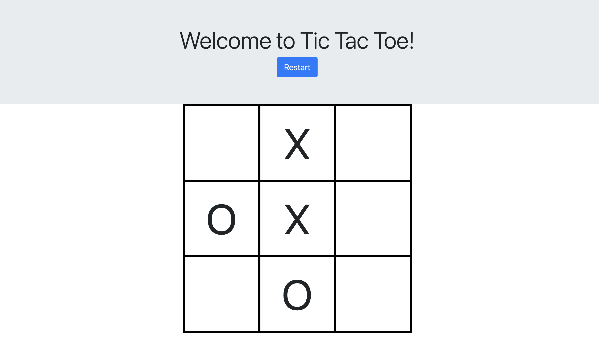
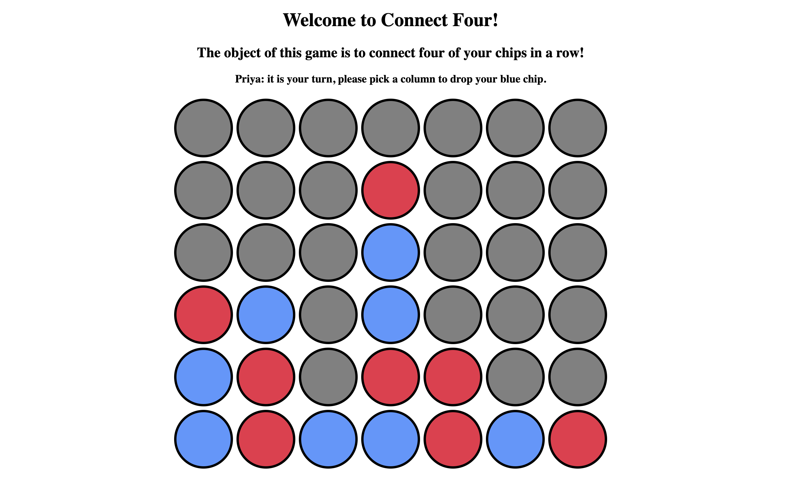

# Django

This repository contains exercises and projects covered under the Udemy course. Each topic covered in the course is organized into separate directories.

<!--  -->

## Topics Covered

1. HTML
2. CSS
3. JavaScript

## HTML

This directory contains exercises and projects related to HTML.

## CSS

This directory contains exercises and projects related to CSS.

## JavaScript
Covered DOM and jQuery.

### Tic Tac Toe
Tic Tac Toe is a simple game built using HTML, CSS, and JavaScript. It allows the user to either add "X", "O" into the 3x3 grid. There is "Restart" button to reset the game.

Here's a screenshot of the game interface:

### Connect four
Connect four is a simple game built using HTML, CSS, and JavaScript (jQuery). It allows players to drop colored chips into a grid, aiming to connect four of their chips in a row horizontally, vertically, or diagonally before their opponent does.

Here's a screenshot of the game interface:

